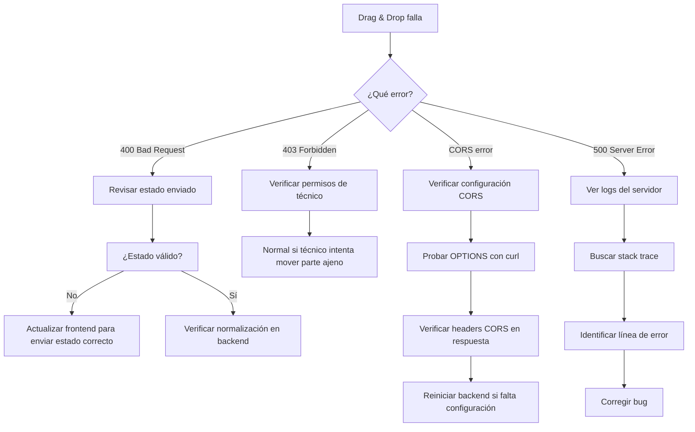

# 🔧 Guía de Diagnóstico - Drag & Drop en Producción

## ⚡ Cambios Implementados

### 1. **Normalización de Estados en Drag & Drop**
- ✅ `updatePartesOrden` ahora normaliza estados automáticamente
- ✅ `updateParte` valida y normaliza estados antes de guardar
- ✅ Soporta estados antiguos: `reparado` → `ausentes`, `visitado` → `visitas_realizadas`, `revisado` → `revisando`

### 2. **Logging Detallado (DEBUG_PARTES=true)**
Cuando arrastras un parte, ahora se loguea:
```
🔄 [DRAG&DROP updateParte]
  ParteId: 123
  Usuario: { username: 'admin', name: 'Marcos', role: 'admin' }
  Estado recibido: ausentes
  Estado normalizado: ausentes
  Estado anterior: inicial
  ✅ Parte actualizado correctamente
  📊 Estado final: ausentes
```

### 3. **CORS Mejorado**
- ✅ Configuración explícita para `https://misterclima.es`
- ✅ Métodos: GET, POST, PUT, DELETE, OPTIONS, PATCH
- ✅ Handler específico para preflight OPTIONS
- ✅ Caché de preflight: 24 horas

### 4. **Validación de Estados Mejorada**
- ✅ Mensajes de error más descriptivos
- ✅ Indica qué estado recibió y cuáles son válidos
- ✅ Logging automático de rechazos

---

## 🔍 Cómo Diagnosticar el Error en Producción

### Paso 1: Abrir DevTools en Producción
1. Ir a https://misterclima.es/partes
2. Login como admin o técnico
3. Abrir DevTools (F12)
4. Ir a la pestaña **Network**
5. Filtrar por "Fetch/XHR"

### Paso 2: Intentar Mover un Parte
1. Arrastra un parte de "Parte inicial" a "Revisando"
2. Ver qué request falla en Network

### Paso 3: Recopilar Información

**Anota estos datos:**

#### A) Request URL
Ejemplo: `https://misterclima.es/api/partes/123`

#### B) Request Method
Ejemplo: `PUT`

#### C) Status Code
Ejemplo: `400`, `403`, `500`, etc.

#### D) Request Headers
Busca:
- `Authorization: Bearer ...`
- `Content-Type: application/json`
- `Origin: https://misterclima.es`

#### E) Request Payload (Body)
Copia el JSON completo, ejemplo:
```json
{
  "id": 123,
  "numero_parte": "123456",
  "aparato": "Aire Acondicionado",
  "poblacion": "Madrid",
  "nombre_tecnico": "José",
  "observaciones": null,
  "estado": "revisando",
  ...
}
```

#### F) Response Body
Copia el JSON de respuesta, ejemplo:
```json
{
  "ok": false,
  "message": "Estado inválido: \"ausentes\". Debe ser uno de: inicial, revisando, visitas_realizadas, ausentes",
  "estadoRecibido": "ausentes",
  "estadoNormalizado": "ausentes",
  "estadosValidos": ["inicial", "revisando", "visitas_realizadas", "ausentes"]
}
```

---

## 📋 Checklist de Verificación

### En el Navegador (Frontend)

**Console (F12 → Console):**
- [ ] ¿Hay errores en rojo?
- [ ] ¿Aparece mensaje "CORS blocked" o "preflight failed"?
- [ ] ¿Aparece "401 Unauthorized" o "403 Forbidden"?

**Network (F12 → Network → Fetch/XHR):**
- [ ] Request URL es `https://misterclima.es/api/partes/:id` o `/api/partes/orden`?
- [ ] Method es `PUT`?
- [ ] Status Code es 200 (OK) o 4xx/5xx (Error)?
- [ ] Request tiene header `Authorization: Bearer ...`?
- [ ] Response tiene JSON con `{ok: true}` o `{ok: false, message: "..."}`?

### En el Servidor (Backend)

**Logs del servidor:**
```bash
# Activar debug temporal
# En .env de producción:
DEBUG_PARTES=true

# Reiniciar backend
pm2 restart beesoftware-backend

# Ver logs en tiempo real
pm2 logs beesoftware-backend --lines 50
```

**Buscar en logs:**
- [ ] `🔄 [DRAG&DROP updateParte]` - Confirma que la request llega
- [ ] `Estado recibido:` - Qué estado envió el frontend
- [ ] `Estado normalizado:` - Qué estado se guardará
- [ ] `❌ Estado inválido rechazado:` - Si rechaza el estado
- [ ] `✅ Parte actualizado correctamente` - Si funciona

---

## 🚨 Escenarios de Error y Soluciones

### Error 1: 400 Bad Request - Estado inválido

**Síntoma:**
```json
{
  "ok": false,
  "message": "Estado inválido: \"reparado\". Debe ser uno de: inicial, revisando, visitas_realizadas, ausentes"
}
```

**Causa:** El frontend envía un estado antiguo que no se normaliza.

**Solución:**
1. Verificar que el backend tiene el código actualizado:
```bash
curl https://misterclima.es/api/version
```

2. Si `timestamp` es antiguo, hacer deployment:
```bash
cd /path/to/backend
git pull
pm2 restart beesoftware-backend
```

---

### Error 2: 403 Forbidden - No tienes permiso

**Síntoma:**
```json
{
  "ok": false,
  "message": "No tienes permiso para editar este parte"
}
```

**Causa:** Técnico intenta mover un parte que no es suyo.

**Solución:** Normal, es la validación de permisos funcionando. Solo admin puede mover partes de otros técnicos.

---

### Error 3: CORS Error - preflight failed

**Síntoma en Console:**
```
Access to fetch at 'https://misterclima.es/api/partes/123' from origin 'https://misterclima.es' 
has been blocked by CORS policy: Response to preflight request doesn't pass access control check
```

**Causa:** Backend no responde correctamente al OPTIONS.

**Diagnóstico:**
```bash
# Probar OPTIONS manualmente
curl -X OPTIONS https://misterclima.es/api/partes/123 \
  -H "Origin: https://misterclima.es" \
  -H "Access-Control-Request-Method: PUT" \
  -v
```

**Debe responder:**
- Status: 204 o 200
- Headers:
  - `Access-Control-Allow-Origin: https://misterclima.es`
  - `Access-Control-Allow-Methods: GET, POST, PUT, DELETE, OPTIONS, PATCH`
  - `Access-Control-Allow-Headers: Content-Type, Authorization, ...`

**Solución:**
1. Verificar que backend tiene CORS configurado (ya actualizado en index.js)
2. Reiniciar backend:
```bash
pm2 restart beesoftware-backend
```

---

### Error 4: 401 Unauthorized - Token inválido

**Síntoma:**
```json
{
  "ok": false,
  "message": "Token no válido"
}
```

**Causa:** Token expirado o inválido.

**Solución:**
1. Cerrar sesión y volver a hacer login
2. Verificar que el token se envía:
```javascript
// En DevTools Console:
localStorage.getItem('token')
```

---

### Error 5: 500 Internal Server Error

**Síntoma:**
```json
{
  "ok": false,
  "message": "Error al actualizar el parte",
  "error": "Cannot read property 'estado' of null"
}
```

**Causa:** Error en el backend (bug).

**Solución:**
1. Ver logs completos en servidor:
```bash
pm2 logs beesoftware-backend --lines 200 --err
```

2. Buscar el stack trace completo
3. Verificar que la BD tiene el parte con ese ID

---

## 🧪 Tests Manuales

### Test 1: Mover de Inicial → Revisando
1. Login como admin
2. Arrastra un parte de "Parte inicial" a "Revisando"
3. **Esperado:** Se mueve y queda en "Revisando" tras recargar (F5)

### Test 2: Mover de Revisando → Visitas Realizadas
1. Arrastra un parte de "Revisando" a "Visitas realizadas"
2. **Esperado:** Se mueve correctamente

### Test 3: Mover de Visitas Realizadas → Ausentes
1. Arrastra un parte de "Visitas realizadas" a "Ausentes"
2. **Esperado:** Se mueve correctamente

### Test 4: Mover hacia atrás (Ausentes → Inicial)
1. Arrastra un parte de "Ausentes" a "Parte inicial"
2. **Esperado:** Se mueve correctamente (el sistema permite movimiento bidireccional)

### Test 5: Reordenar dentro de columna
1. Arrastra un parte dentro de "Revisando" (cambiar orden)
2. **Esperado:** El orden cambia y persiste tras recargar

### Test 6: Como técnico (solo sus partes)
1. Login como técnico (José, Tadas, Enrique o Deve)
2. Intentar mover un parte suyo
3. **Esperado:** Funciona correctamente
4. Intentar mover un parte de otro técnico
5. **Esperado:** No debería poder (no aparece en su vista)

---

## 📊 Verificación con curl (Sin Frontend)

### Test Backend Directamente

**1. Login y obtener token:**
```bash
TOKEN=$(curl -s -X POST https://misterclima.es/api/auth/login \
  -H "Content-Type: application/json" \
  -d '{"username":"marcos","password":"1234"}' \
  | jq -r '.token')

echo "Token: $TOKEN"
```

**2. Mover un parte (cambiar estado):**
```bash
curl -X PUT https://misterclima.es/api/partes/123 \
  -H "Content-Type: application/json" \
  -H "Authorization: Bearer $TOKEN" \
  -d '{
    "estado": "revisando"
  }'
```

**Respuesta esperada:**
```json
{
  "ok": true,
  "message": "Parte actualizado exitosamente",
  "data": {
    "id": 123,
    "estado": "revisando",
    ...
  }
}
```

**3. Verificar que se guardó:**
```bash
curl https://misterclima.es/api/partes/123 \
  -H "Authorization: Bearer $TOKEN"
```

---

## 🔄 Workflow de Resolución



---

## 📞 Información a Proporcionar para Ayuda

**Copia y pega esto con tus datos:**

```
DIAGNÓSTICO DRAG & DROP PRODUCCIÓN
====================================

1. URL de la request que falla:
   https://misterclima.es/api/partes/___

2. Método HTTP:
   [ ] GET  [ ] POST  [X] PUT  [ ] DELETE

3. Status Code:
   ___

4. Request Headers:
   Authorization: Bearer ___
   Content-Type: application/json
   Origin: ___

5. Request Body (JSON):
   ```json
   {
     ...
   }
   ```

6. Response Body (JSON):
   ```json
   {
     ...
   }
   ```

7. Errores en Console (si hay):
   ___

8. Versión del backend:
   (resultado de curl https://misterclima.es/api/version)
   ```json
   {
     ...
   }
   ```

9. Logs del servidor (últimas 20 líneas):
   ```
   ...
   ```
```

---

## ✅ Solución Implementada - Resumen

### Archivos Modificados:

1. **backend/src/controllers/partes.controller.js**
   - Normalización en `updatePartesOrden`
   - Logging detallado en `updateParte` y `updatePartesOrden`
   - Validación mejorada con mensajes descriptivos

2. **backend/src/repositories/partes.repository.js**
   - `updatePartesOrden` soporta actualización de estado

3. **backend/src/index.js**
   - CORS mejorado con configuración explícita
   - Handler para OPTIONS preflight

### Próximos Pasos:

1. **Deployment en producción**
2. **Activar DEBUG_PARTES=true temporalmente**
3. **Probar drag & drop en producción**
4. **Recopilar información si falla** (usar este documento)
5. **Desactivar DEBUG_PARTES=false**

---

**Última actualización:** 17 de diciembre de 2025  
**Versión:** 1.0.0
